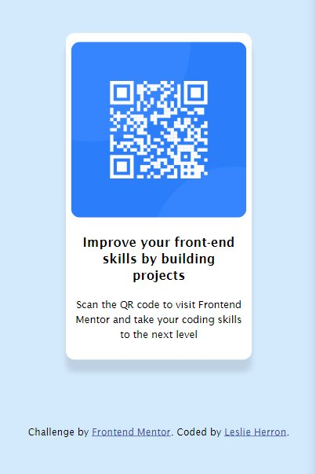

# Frontend Mentor - QR code component solution

This is a solution to the [QR code component challenge on Frontend Mentor](https://www.frontendmentor.io/challenges/qr-code-component-iux_sIO_H). Frontend Mentor challenges help you improve your coding skills by building realistic projects. 

## Table of contents

- [Overview](#overview)
  - [Screenshot](#screenshot)
  - [Links](#links)
- [My process](#my-process)
  - [Built with](#built-with)
  - [What I learned](#what-i-learned)
  - [Continued development](#continued-development)
- [Author](#author)

## Overview

### Screenshot




### Links

- Solution URL: [GitHub Repository](https://github.com/lesherron/QR-Code-Component)
- Live Site URL: [Add live site URL here](https://your-live-site-url.com)

## My process

### Built with

- HTML
- CSS

### What I learned

I'm continuing to practice HTML, CSS, and the box-shadow property to create a shadow effect around the QR code.

```css
.whiterect {
      background-color: white;
      width: 288px;
      height: 430px;
      border-radius: 10px;
      margin-left: 16px;
      margin-top: 16px;
      box-shadow: 0px 5px 10px 5px hsl(180, 1%, 74%);
    }
```

### Continued development

I want to get more comfortable with CSS and learning advanced CSS techniques. Also, I need to get better using git respositories and how to leverage their power for my projects.

## Author

- Website - [GitHub](https://github.com/lesherron/QR-Code-Component)
- Frontend Mentor - [@lesherron](https://www.frontendmentor.io/profile/lesherron)


